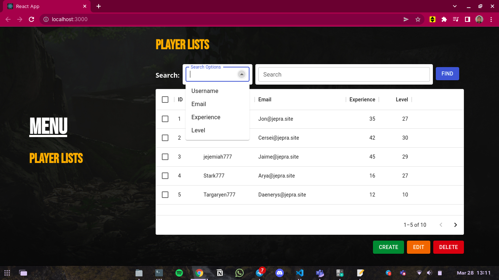
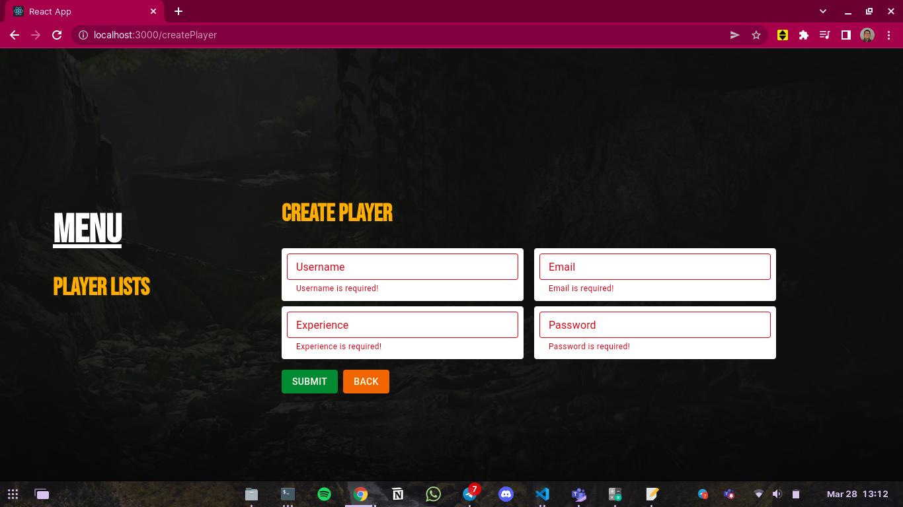
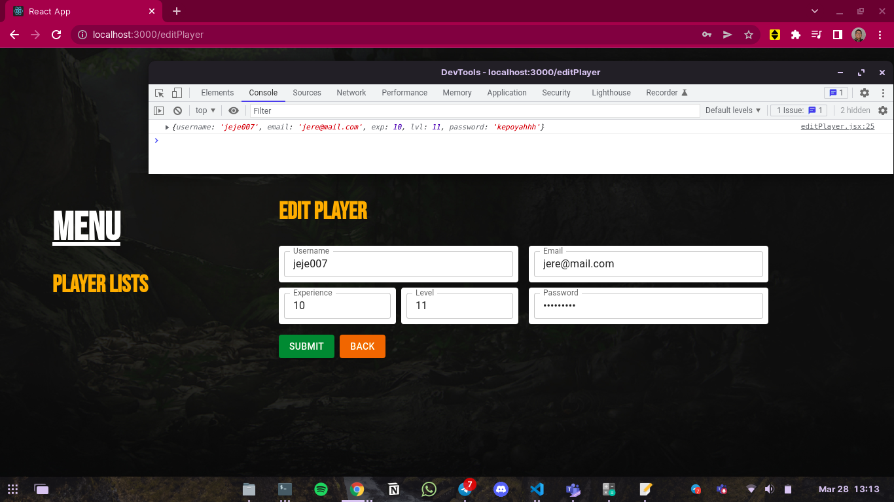

# Binar Academy Bootcamp - FSW - Chapter 8 - Challenge

Ini adalah repository RESTful API yang menjadi basis untuk teman-teman berkreasi di challenge chapter 8. Ikuti petunjuk di bawah dengan seksama untuk memastikan teman-teman dapat menjalankan RESTful API.

## Prasyarat
Sebelum memulai menyentuh repository, pastikan komputer teman-teman memenuhi prasyarat berikut:
- sudah install Node.js & NPM
- sudah install PostgreSQL
- sudah install git

## Project setup
1. Fork repository ini. Ada tombol 'fork' di kanan atas atau klik https://github.com/berbinarbinar/binar-challenge-chapter-8.git. Lalu fork dan nanti akan muncul repository yang sama persis di akun teman-teman.
2. Clone repository teman-teman yang sudah di fork 

```
$ git clone https://github.com/[username_kalian]/binar-challenge-chapter-8.git
```

3. Pindah ke folder repository yang udah di clone dgn perintah 
`cd binar-challenge-chapter-8`
4.  Install dependencies dgn command `npm install`
5.   Pastikan sudah membuat database sesuai konfigurasi di `/config/config.js` jika belum jalankan saja `npx sequelize db:create` dan juga pastikan kita harus berada pada directory `server` kalau belum `cd server`
6.   Lanjutkan dengan menjalankan migrasi, sebelumnya kita harus masuk pada directory `server` dulu ya, `npx sequelize db:migrate`
7.   Kamu juga bisa jalankan file seed yang sudah dibuat dengan cara `npx sequelize db:seed:all`
### Run
Untuk menjalankan aplikasi RESTful API, cukup jalankan perintah berikut
```
$ npm run start
```

## Tasks
Jika teman-teman sudah berhasil menjalankan aplikasi RESTful API dari repository ini, teman-teman perlu melakukan dua hal:
1. Membuat dokumentasi API dengan Swagger
    - [V] Baca code repository RESTful API ini baik-baik
    - [V] Buat dokumentasi untuk semua endpoint yang terdaftar di router
    - [V] Dokumentasi melingkupi : 
        - [V] HTTP method
        - [V] URL
        - [V] URL parameter (jika ada)
        - [V] Query parameter (jika ada)
        - [V] Request body (jika ada)
        - [V] format response
    - [V] Pasang dokumentasi Swagger dalam satu routing
2. Membuat client-side application dengan React.js
    - [V] Buat folder baru, misalkan /client, kemudian buat project baru dalam folder tersebut dengan `$ npm init -y` atau `$ npx create-react-app client`
    - [V] Buat tampilan/UI untuk fitur berikut :
        - [V] Form untuk membuat player baru, dengan tombol Submit
        - [V] Form untuk mengedit player, dengan tombol Submit
        - [V] Form untuk pencarian player berdasarkan 4 kriteria pencarian : username, email, experience, dan lvl. jangan lupa juga tombol submit.
    - [V] Kita belum belajar mengintegrasikan back-end dan front-end. Jadi untuk challenge ini, ketika di klik tombol submit tampilkan semua input sebagai satu elemen HTML baru
        - [V] Untuk form membuat atau edit player, tampilkan info username, email, dll setelah di klik submit. 
        - [V] Untuk form mencari player, tampilkan ulang input kriteria username, email, experience, dan lvl.
    - [V] Jalankan sebagai aplikasi client-side (npm run start di folder client (buat run react app))

## Caveats / Batasan
- Tugas nomor 1 dan 2 dibuat dalam repository yang sama dengan repository RESTful API. Dengan kata lain, teman-teman bertugas mengembangkan repository RESTful API ini menjadi repository full-stack (RESTful API + client-side + documentation)
- Code existing yang ada dalam folder /app tidak boleh diubah/dihapus, kecuali bagian config db. Yang diperbolehkan hanya penambahan line untuk memenuhi challenge. 
- Jika teman-teman menemukan error/bug dalam code, silakan buat issue di repository ini atau sampaikan ke tim Binar Academy
- Pastikan folder node_modules masuk dalam .gitignore, baik untuk RESTful API maupun client-side.
- Nantinya, aplikasi RESTful API dan client-side akan berjalan sebagai 2 aplikasi berbeda. Pastikan keduanya bisa berjalan berbarengan tanpa ada issue.

## Petunjuk Submission
- Challenge di submit paling lambat hari Senin di minggu ketiga chapter 8, pukul 23:59 WIB.
- metode submission: kirim email ke mentor dan bagian akademik Binar, berisi link repository teman-teman (yang di fork) di Gitlab.

## Hasil
- Dokumentasi Postman Dapat Diakses di https://documenter.getpostman.com/view/19147947/UVsLRm6t
- DOkumentasi Swagger Dapat Diakses di http://localhost:4000/api-docs/
- Player Lists Menu:

- Create Player Form:

- Edit Player Form:
